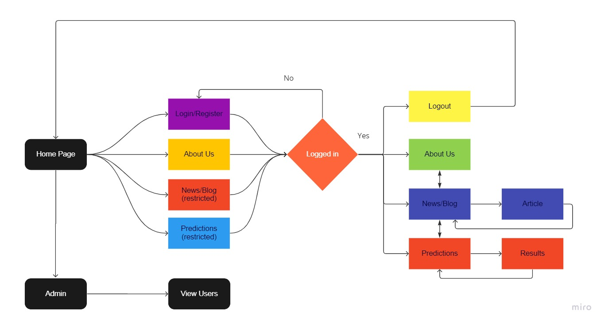

# Stock Prediction Website

In this project, we will examine the stock price of a company as reported from real historic data from thousands of investments. Some features along with additional data for identification of data entries will be supplied as a Comma Separated File (.csv), that may be opened and analysed in Excel, Spreadsheet or python. This project then focuses on developing a model that predicts the target return rate of investments. The primary objective of this project would be to deploy a website that helps predicting the investment returns based on some features given as an input. 
The website uses HTML, CSS, JavaScript, Bootstrap, jQuery for the front end. The backend utilises Django, python along with PostgreSQL database.
The website features a login page that allows an existing user to login and a register page that allows a new user to register and gain access to the website services. The data is stored in the database along with the predictions for future reference. These predictions are then displayed on the webpage in a user-friendly interface.

## Tools Used

### Front-end
HTML, CSS and JavaScript
HTML will define the content and the basic structure of the website; CSS will be used to give style and structure to the content, while, JavaScript will be used to introduce interactive functionality to the website.

### Bootstrap
Bootstrap is an HTML, CSS and JS Library that helps simplifying the development of informative web pages by the application of Bootstrap's choices of colour, size, font and layout.

### Back-end
Django
Django is a high-level Python web framework for building secure and maintainable websites. It is free and open source and helps us write software that is complete, versatile, secure, scalable, maintainable and portable.

### PostgreSQL
PostgreSQL also known as Postgres, is a free and open-source relational database management system (RDBMS) emphasizing extensibility and SQL compliance.

## Block Diagram of the Project

The Block Diagram depicts the Control Flow of the Webpages included in this Website. It Describes the interconnection and interdependency of the Modules and the navigation of the User between the Webpages.

