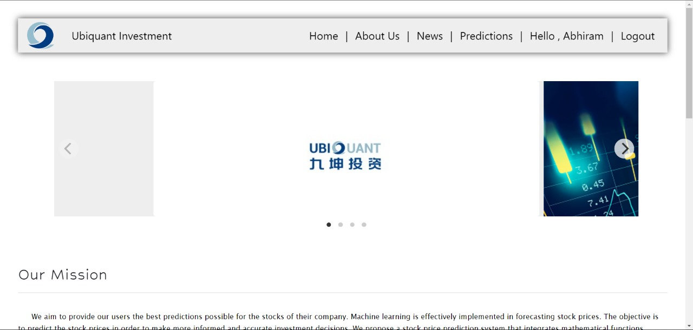

# Stock Prediction Website

In this project, we will examine the stock price of a company as reported from real historic data from thousands of investments. Some features along with additional data for identification of data entries will be supplied as a Comma Separated File (.csv), that may be opened and analysed in Excel, Spreadsheet or python. This project then focuses on developing a model that predicts the target return rate of investments. The primary objective of this project would be to deploy a website that helps predicting the investment returns based on some features given as an input. 
The website uses HTML, CSS, JavaScript, Bootstrap, jQuery for the front end. The backend utilises Django, python along with PostgreSQL database.
The website features a login page that allows an existing user to login and a register page that allows a new user to register and gain access to the website services. The data is stored in the database along with the predictions for future reference. These predictions are then displayed on the webpage in a user-friendly interface.

  

## Tools Used

### Front-end
HTML, CSS and JavaScript
HTML will define the content and the basic structure of the website; CSS will be used to give style and structure to the content, while, JavaScript will be used to introduce interactive functionality to the website.

### Bootstrap
Bootstrap is an HTML, CSS and JS Library that helps simplifying the development of informative web pages by the application of Bootstrap's choices of colour, size, font and layout.

### Back-end
Django
Django is a high-level Python web framework for building secure and maintainable websites. It is free and open source and helps us write software that is complete, versatile, secure, scalable, maintainable and portable.

### PostgreSQL
PostgreSQL also known as Postgres, is a free and open-source relational database management system (RDBMS) emphasizing extensibility and SQL compliance.

  

## Block Diagram of the Project

The Block Diagram depicts the Control Flow of the Webpages included in this Website. It Describes the interconnection and interdependency of the Modules and the navigation of the User between the Webpages.

  

## Modules Description
Stock Market Prediction  
A stock market is a public market where you may purchase and sell shares in firms that are publicly traded. The stocks, also known as equities, indicate the company's ownership. The stock exchange acts as a middleman between buyers and sellers of stocks. 
Stock market plays a crucial role in the economy since it serves as an indicator of the economy. Stock markets help companies raise capital. It helps generate personal wealth. 
Therefore, the Stock Market Prediction module of the project is the core focus of the website. A Machine Learning model is deployed. The model predicts the investment return when the date, month and year are given as inputs using Machine Learning and Artificial Intelligence techniques. These predictions are then displayed on the webpage in a user-friendly interface.

Registration  
The website possesses a login page that gives permission to an existing user to login and a register page that gives permission to a new user to register and access the website services. The data is then stored in the database along with the predictions for future reference.
The login page requires a username and password from the user. It is then validated using the details stored in the database.
New users need to register with the application. For this, they need to enter various details such as first name, last name, username, email id and password.
All these details are then stored in the database. Thus, it helps us to keep a record of the users that have visited our website.

News  
The news page features the latest news, articles of interest, latest trends and other helpful information written by users and published by moderators on the blog post. It thus involves active tracking of the latest stock trends. It displays information regarding the most active stocks in the market. 

  

## Project Outcomes
The Login & Registration Page
 

 

The Home Page
 

 

The About Us Page
 

 

The Predictions Page
 
